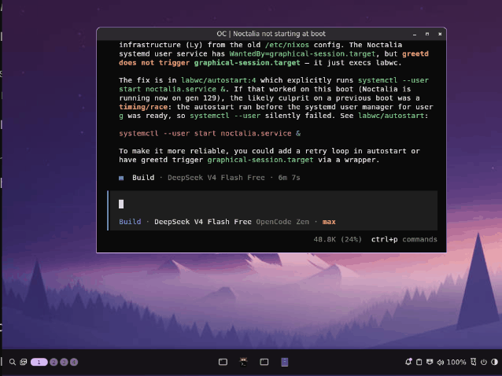

# NixOS + Noctalia + Labwc Flake

[](https://nixos.org)
[](https://github.com/grigio/nixos-noctalia-labwc-flake/actions/workflows/update-flake.yml)
[](https://github.com/grigio/nixos-noctalia-labwc-flake/actions/workflows/ci.yml)



Declarative NixOS 26.11 flake for a modern Wayland desktop — **labwc** compositor + **Noctalia V5** AI desktop shell + **Voxtype** voice-to-text.

Designed for AMD hardware (GPU + CPU microcode) with pure Wayland (no XWayland).

## Features

- **Labwc** — lightweight Wayland compositor, 4 virtual desktops, multi-monitor
- **Noctalia V5** — AI-powered shell (panel, launcher, session, OSD recommender)
- **Voxtype** — offline voice-to-text via Whisper.cpp (ggml-base multilingual), triggered by Right Alt
- **Color sync** — `noctalia-labwc-theme-sync` reads Noctalia's palette → WCAG-contrast window decorations → `labwc --reconfigure`
- **greetd + tuigreet** — auto-login TUI greeter
- **PipeWire** — audio with ALSA + PulseAudio compat, WirePlumber session manager
- **Screen capture** — Print screen → `grim` + `slurp` region select → `satty` annotation editor
- **OBS-cmd** — scene switching (`Alt-1..5`, `Alt-e`) and recording toggle (`Alt-r`)
- **Bluetooth** — enabled (no power-on-boot)
- **AMD fine-tuning** — `amdgpu.runpm=0` (fixes PSP LOAD_TA), microcode updates
- **GNOME Keyring** + **polkit-gnome** — credential storage and privilege escalation
- **Nix GC** — automatic weekly, deletes generations older than 7 days
- **GDK/icon fixes** — Adwaita icon theme linked, Trash icon visible in Nautilus
- **Compose key** — Caps Lock as compose key (Wayland-native)
- **Kanshi** — automatic display profile management
- **Clipman** — clipboard manager
- **auto-cpufreq** — dynamic CPU frequency tuning

## First-time setup

```bash
# 1. Clone the repo to your system (e.g. at /etc/nixos)
sudo git clone https://github.com/grigio/nixos-noctalia-labwc-flake.git /etc/nixos

# 2. Generate hardware configuration for your machine
nixos-generate-config --show-hardware-config > /etc/nixos/.config/nixos-backup/hardware-configuration.nix

# 3. Rebuild
sudo nixos-rebuild switch --flake /etc/nixos#nixos --accept-flake-config
```

The flake lives in `.config/nixos-backup/`. The `hardware-configuration.nix` is **not** tracked by git
(see [.gitignore](.gitignore)) — each machine generates its own.

## Rebuild

```bash
sudo nixos-rebuild switch --flake /etc/nixos#nixos --accept-flake-config
```

`--accept-flake-config` is required to trust the `noctalia.cachix.org` binary cache.

## Validate before applying

Run the same checks as CI before rebuilding:

```bash
# Show flake outputs
nix flake show ./.config/nixos-backup

# Format/lint checks (same as CI)
nix develop --command deadnix --fail .
nix develop --command statix check . || true
nix run --no-write-lock-file 'github:numtide/nixpkgs-fmt' -- --check . || true

# Validate and build the system closure
nix build .#nixosConfigurations.nixos.config.system.build.toplevel --accept-flake-config
```

`|| true` keeps `statix`/`nixpkgs-fmt` non-failing (same as CI).

## Upgrade

```bash
cd /etc/nixos/.config/nixos-backup
nix flake update             # update flake.lock to latest inputs
sudo nixos-rebuild switch --flake /etc/nixos#nixos --accept-flake-config
```

## Change the user name

The default user is `g`. To rename it, edit `.config/nixos-backup/configuration.nix`:

1. Change `users.users.g` to `users.users.<newname>` (line ~687).
2. Update the `initial_session.user` in `services.greetd.settings` (line ~412) from `"g"` to `"<newname>"`.
3. Rebuild with `sudo nixos-rebuild switch` and reboot.
4. The old home directory `/home/g` will remain — either symlink it or move contents.

## Notes

- Noctalia is installed from `nixpkgs-unstable` via `environment.systemPackages`.
- Bootloader: **Limine** (not systemd-boot).
- `hardware-configuration.nix` is automatically imported if present — no manual uncommenting needed.

## Automatic flake updates

A GitHub Actions workflow ([update-flake.yml](.github/workflows/update-flake.yml)) runs every Monday at 06:00 UTC to update `flake.lock` and open a PR. It validates the config by building the full NixOS system closure with `nix build .#nixosConfigurations.nixos.config.system.build.toplevel` before proposing the change.
